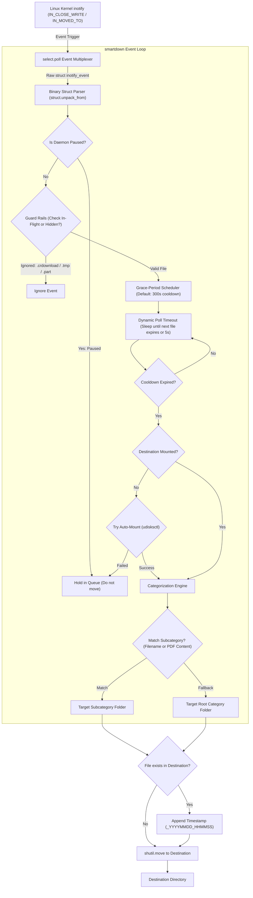

# smart-downloads-daemon 📂

[](#)
[](#)
[](https://github.com/Rafael-Albernaz-dev/smart-downloads-daemon/actions/workflows/ci.yml)
[](#)
[](LICENSE)

A high-performance, zero-dependency Linux background daemon that automatically organizes your `~/Downloads` directory into categorized `~/Documents` folders using direct kernel `inotify` syscalls and an intelligent **grace-period cooldown**.

---

## The Problem: Why Traditional File Organizers Fail

Most automated download organizers suffer from critical usability and architectural flaws:

1. **The "Instant-Move" Annoyance**: You download a PDF or image to immediately drag-and-drop it into an email, browser form, or Slack. A naive script moves it 0.5 seconds later, breaking your upload and making you go hunting through folders.
2. **CPU & Battery Drain (Busy-Waiting)**: Many scripts use infinite `while True: sleep(5)` loops that continuously poll directory trees, spinning CPU cycles and keeping the CPU out of low-power sleep states.
3. **Heavy Dependency Bloat**: Popular tools rely on heavy third-party file watcher packages (`watchdog`) or background servers that consume 50MB–100MB of RAM for a task that Linux kernels natively support.

---

## The Solution: Native inotify with Grace-Period Cooldown

`smart-downloads-daemon` resolves all three problems:

* **Direct `libc inotify` Syscalls via `ctypes`**: Communicates directly with the Linux kernel via `inotify_init1(0)` and `inotify_add_watch` with binary struct decoding (`struct inotify_event`). Zero third-party dependencies.
* **0% Idle CPU (`select.poll`)**: The event loop sleeps in the kernel until an actual I/O event occurs or the next file cooldown expires. Zero busy-waiting.
* **Smart Grace Period (5-Minute Cooldown)**: Files and folders remain immediately available in `~/Downloads` for quick access. Only after 5 minutes of inactivity are they moved to their permanent home in `~/Documents`.
* **Full Directory & Folder Organization**: Safely classifies and organizes downloaded folders (e.g. Google Drive download batches) into `Pastas` or matching subcategories, protected by recursive in-flight download guards.
* **Visual Desktop Notifications**: Non-blocking desktop notifications on Linux via native `notify-send` with automatic `systemd --user` display discovery and toggleable configuration (`smartdown config --set-notifications on|off`).
* **Smart Subcategories & Content Sniffing**: Files are classified into context-aware subfolders (e.g. `PDF/Ordem de Servico`, `PDF/Boletos`, `Planilhas/Cobranca e Negativacao`) via keyword matching and non-intrusive PDF content sniffing (via native `pdftotext`).
* **Batch Directory Reorganization**: Reorganize existing flat category folders into the new subcategory structure safely with `smartdown organize` (`--dry-run` and `--apply`).
* **Full Activity Logs & Migration History**: View persistent, complete history of all organized and migrated files with `smartdown logs`, supporting real-time streaming (`-f`), filtering, and JSON export.
* **Pause & Resume Controls**: Easily suspend sorting (`smartdown pause`) when working with temporary downloads and resume (`smartdown resume`) when ready.
* **Mount Guard & Auto-Recovery**: If a secondary/external drive is unmounted, holds downloads safely in `~/Downloads` without log spam, and auto-mounts on demand (`smartdown mount`).
* **Live Status Dashboard**: View countdown timers for pending downloads and folders, service uptime, paused state, and disk health with `smartdown status` (or `--json`).
* **In-Flight Download Guards**: Automatically ignores incomplete browser downloads (`.crdownload`, `.part`, `.tmp`, `.download`) both for top-level files and within directories until writing has completely finished.
* **Timestamped Collision Protection**: If `report.pdf` or `folder_name` already exists in destination, it is automatically renamed to `name_YYYYMMDD_HHMMSS` without overwriting data.
* **Single-Instance Protection**: Prevents duplicate concurrent daemon processes with automatic background service detection and POSIX lockfile guards.
* **Native `systemd --user` Integration**: Runs seamlessly as a background user service on Linux login.

---

## Architecture



---

## Default Category Mapping

| Category | File Extensions |
| :--- | :--- |
| **PDF** | `pdf` |
| **Textos** | `txt`, `md`, `doc`, `docx`, `odt`, `rtf`, `log` |
| **Planilhas** | `xls`, `xlsx`, `csv`, `ods`, `tsv` |
| **Imagens** | `png`, `jpg`, `jpeg`, `gif`, `webp`, `svg`, `bmp`, `ico`, `tiff` |
| **Videos** | `mp4`, `mkv`, `avi`, `mov`, `webm`, `flv`, `wmv`, `m4v` |
| **Audios** | `mp3`, `wav`, `ogg`, `flac`, `m4a`, `aac`, `wma` |
| **Compactados** | `zip`, `tar`, `gz`, `bz2`, `7z`, `rar`, `xz`, `iso` |
| **Pastas** | Downloaded directories and multi-file folders |
| **Outros** | Any uncategorized extension |

### Smart Subcategories Taxonomy

Files inside supported categories are automatically sorted into subdirectories based on filename patterns or PDF content analysis:

| Category | Subcategory | Rules & Keywords / Content Sniffing |
| :--- | :--- | :--- |
| **PDF** | `Ordem de Servico` | Filename: `ordem`, `servico`, `os_`, `os-`, `os `.<br>Content: `Ordem Técnica de Serviço`, `RURAL CONECTA`, `Ordem de Serviço` |
| **PDF** | `Boletos` | Filename: `boleto`, `fatura`, `segundavia`, `2via`, `pagamento`, `mensalidade`, `itau`, `bradesco`, `santander`, `caixa`, `inter`, `nubank` |
| **PDF** | `DRS` | Filename: `drs`, `relatorio_drs`, `relatorio-drs` |
| **PDF** | `Atlas` | Filename: `atlas`, `viabilidade`, `projeto_atlas` |
| **PDF** | `Marketing` | Filename: `marketing`, `campanha`, `publicidade`, `social` |
| **PDF** | `Contratos` | Filename: `contrato`, `adesao`, `termo`, `aditivo` |
| **PDF** | `Documentos Empresa` | Filename: `cnpj`, `alvara`, `estatuto`, `procuracao`, `certidao` |
| **Planilhas** | `OS e Atendimentos` | Filename: `ordem`, `servico`, `os`, `atendimento`, `chamado`, `suporte` |
| **Planilhas** | `Cobranca e Negativacao` | Filename: `cobranca`, `inadimplente`, `negativad`, `spc`, `serasa`, `devedor`, `suspens` |
| **Planilhas** | `Equipamentos e Estoque` | Filename: `equipamento`, `estoque`, `retirada`, `roteador`, `onu`, `fibra` |
| **Planilhas** | `Clientes e Contratos` | Filename: `cliente`, `cadastro`, `contrato`, `base`, `assinante` |
| **Imagens** | `Banners e Marketing` | Filename: `banner`, `flyer`, `post`, `instagram`, `facebook`, `story`, `propaganda`, `campanha`, `anuncio` |
| **Imagens** | `ChatGPT IA` | Filename: `chatgpt`, `dall-e`, `openai`, `midjourney`, `prompt` |
| **Imagens** | `Logos e Icones` | Filename: `logo`, `icone`, `icon`, `marca`, `identidade`, `favicon` |
| **Textos** | `Atlas e Desenvolvimento` | Filename: `atlas`, `dev`, `api`, `backend`, `frontend`, `daemon`, `script` |
| **Textos** | `Rotas e Operacional` | Filename: `rota`, `tecnico`, `instalacao`, `manutencao`, `campo` |
| **Textos** | `Clientes e Atendimento` | Filename: `cliente`, `mensagem`, `recado`, `contato`, `telefone` |

---

## Repository Structure

```text
smart-downloads-daemon/
├── .github/workflows/ci.yml       # Automated GitHub Actions test suite
├── pyproject.toml                 # Standard PEP 621 packaging & CLI entrypoints
├── install.sh                     # Installer with systemd --user service setup
├── systemd/
│   └── smart-downloads-daemon.service # Systemd user service unit
├── src/smart_downloads_daemon/
│   ├── __init__.py                # Package version
│   ├── __main__.py                # python -m smart_downloads_daemon support
│   ├── cli.py                     # Command-line interface & argument parser
│   ├── config.py                  # JSON config loader, subcategories & pause definitions
│   ├── history.py                 # Persistent activity logging & live tail inspection
│   ├── inotify.py                 # POSIX libc inotify ctypes wrapper & struct unpacking
│   ├── migrator.py                # Batch storage migration engine across disks
│   ├── notifier.py                # Desktop visual notifications via notify-send & display discovery
│   ├── organizer.py               # Batch reorganization into intelligent subcategories
│   ├── sorter.py                  # Subcategory resolution, guards & collision renaming
│   └── watcher.py                 # select.poll dynamic event loop & grace scheduling
└── tests/
    ├── test_cli.py                # CLI commands, status, pause & lock tests
    ├── test_config.py             # Config loading, pause control & disk helpers
    ├── test_history.py            # Persistent history recording, filtering & CLI tests
    ├── test_inotify.py            # Struct size & initialization tests
    ├── test_migrator.py           # Migration planning & collision tests
    ├── test_notifier.py           # Desktop notification dispatch, fallback & display tests
    ├── test_organizer.py          # Batch reorganize plan & collision tests
    ├── test_sorter.py             # Subcategory classification, content sniffing & tests
    └── test_watcher.py            # File scheduling, pause & retry expiration tests
```

---

## Installation & Setup

### 1. Quick Install

Clone the repository and run the installer:

```bash
git clone https://github.com/Rafael-Albernaz-dev/smart-downloads-daemon.git
cd smart-downloads-daemon
./install.sh
```

### 2. Enable as a Systemd Service (Runs on boot)

```bash
# Enable and start the background service immediately:
systemctl --user enable --now smart-downloads-daemon

# Check service status:
systemctl --user status smart-downloads-daemon

# View live daemon logs:
journalctl --user -u smart-downloads-daemon -f
```

---

## CLI Usage

The executable provides the concise `smartdown` command (with `smart-downloads-daemon` kept as a backwards-compatible alias) for daemon monitoring, pause control, configuration, and storage reorganization:

```bash
# View comprehensive daemon status, operating mode, disk health, and queue:
smartdown status

# Export live status and metrics as JSON:
smartdown status --json

# View recent file organization and migration history:
smartdown logs

# View last 50 log entries:
smartdown logs -n 50

# Follow live activity logs in real-time (like tail -f):
smartdown logs -f

# Filter history logs by category or action:
smartdown logs --category PDF
smartdown logs --action organize

# Export full activity history in JSON format:
smartdown logs --all --json

# Temporarily pause automated file sorting (holds all downloads in ~/Downloads):
smartdown pause

# Resume automated file sorting:
smartdown resume

# Automatically mount destination partition if disconnected/unmounted:
smartdown mount

# Preview reorganizing files in destination categories into smart subdirectories (dry-run):
smartdown organize

# Execute smart directory reorganization:
smartdown organize --apply

# Reorganize a specific directory:
smartdown organize --dir /media/toru/96A10007A0FFEB9D --apply

# View active configuration, directories, and storage free space:
smartdown config --show

# Change destination directory on the fly (saves config and reloads daemon):
smartdown config --set-destination /media/toru/96A10007A0FFEB9D

# Enable or disable desktop visual notifications:
smartdown config --set-notifications on
smartdown config --set-notifications off

# Preview batch migration of existing organized folders (dry-run):
smartdown migrate --to /media/toru/96A10007A0FFEB9D

# Execute batch migration and update config automatically:
smartdown migrate --to /media/toru/96A10007A0FFEB9D --apply

# Run daemon in foreground (single-instance protected):
smartdown --foreground

# Perform a single scan to organize eligible files, then exit:
smartdown --scan-once

# Override grace period cooldown for a session (e.g. 120 seconds):
smartdown --grace-period 120
```

---

## Activity History & Migration Logs

Every file movement, batch reorganization, and cross-disk migration is automatically recorded in a high-performance, append-only JSON Lines ledger (`~/.config/smart-downloads-daemon/history.jsonl`):

```bash
# View recent activity history (newest operations first):
smartdown logs

# Stream file movements live as cooldowns expire (like tail -f):
smartdown logs -f

# Filter operations by category or action:
smartdown logs --category PDF
smartdown logs --action migrate

# Export structured history for scripts or pipelines:
smartdown logs --json

# Clear history logs:
smartdown logs --clear
```

---

## Batch Directory Reorganization

If you already have existing category folders (`PDF/`, `Planilhas/`, etc.) with files directly in the root or want to batch-reorganize them:

```bash
# Preview what would be organized without moving anything:
smartdown organize

# Apply the organization:
smartdown organize --apply
```

* **Intelligent File & Content Inspection**: Checks filenames against subcategory keywords. For PDFs without obvious keywords in the filename, inspects the first page's text using `pdftotext` (e.g., detecting "Ordem Técnica de Serviço" inside client-named PDFs).
* **Safe & Non-Destructive**: Files that do not match any subcategory keyword rules remain safe in the parent category directory. If a file with the same name exists at the destination, a collision-safe timestamp suffix (`_YYYYMMDD_HHMMSS`) is assigned.

---

## Batch Migration & Storage Management

When moving organized categories to a secondary drive (or freeing up space on your primary disk):

1. **Safety First**: The migrator only moves category directories managed by the daemon (`PDF`, `Textos`, `Planilhas`, `Imagens`, `Videos`, `Audios`, `Compactados`, `Outros`). Any personal repos or unmanaged files in the root folder remain strictly untouched.
2. **Atomic Verification**: Files are copied and verified for size before unlinking source files.
3. **Collision Immune**: If a file already exists on the target disk, it is preserved and the incoming file receives an incremental timestamp counter (`_YYYYMMDD_HHMMSS_N`).
4. **Mount Guard**: If a secondary/external drive is unmounted or disconnected, the daemon automatically holds downloads safely in `~/Downloads` until the mount returns, preventing root partition contamination.

---

## Custom Configuration

Settings are saved in `~/.config/smart-downloads-daemon/config.json`:

```json
{
  "downloads_dir": "/home/toru/Downloads",
  "destination_dir": "/media/toru/96A10007A0FFEB9D",
  "grace_period_seconds": 300,
  "categories": {
    "PDF": ["pdf"],
    "Textos": ["txt", "md", "doc", "docx", "odt", "rtf", "log"],
    "Planilhas": ["xls", "xlsx", "csv", "ods", "tsv"],
    "Imagens": ["png", "jpg", "jpeg", "gif", "webp", "svg", "bmp", "ico", "tiff"],
    "Videos": ["mp4", "mkv", "avi", "mov", "webm", "flv", "wmv", "m4v"],
    "Audios": ["mp3", "wav", "ogg", "flac", "m4a", "aac", "wma"],
    "Compactados": ["zip", "tar", "gz", "bz2", "7z", "rar", "xz", "iso"]
  },
  "subcategories": {
    "PDF": {
      "Ordem de Servico": {
        "keywords": ["ordem", "servico", "os_", "os-", "os "],
        "content_keywords": ["ordem técnica de serviço", "rural conecta", "ordem de serviço"]
      },
      "Boletos": {
        "keywords": ["boleto", "fatura", "segundavia", "2via", "pagamento", "mensalidade"]
      }
    }
  },
  "ignore_extensions": [".aria2", ".crdownload", ".download", ".opdownload", ".part", ".tmp"]
}
```

---

## Running Unit Tests

```bash
# Run the test suite with pytest:
pytest -v
```

---

## License

MIT License. See [LICENSE](LICENSE) for details.
